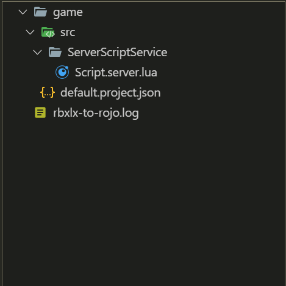

# rbxlx-to-rojo
Tool to convert existing Roblox games into Rojo projects by reading their `rbxlx` place files.

# Using rbxlx-to-rojo
## Setup
Before you can use rbxlx-to-rojo, you need the following:

- At least Rojo 0.5.0 Alpha 12 or higher to use the tool.
- A rbxlx place file that at least has scripts

If there aren't any scripts in the rbxlx file, rbxlx-to-rojo will return an error.

Download the latest release of rbxlx-to-rojo here: https://github.com/rojo-rbx/rbxlx-to-rojo/releases
## Porting the game
Before you can port your game into Rojo projects, you need a .rbxlx file. If you have an existing game that isn't a .rbxlx file: 

- Go to studio, click on any place, and then click on File -> Save to file as.

- Click on the drop-down menu where it says "Roblox Place Files (.rbxl)".

- Click on the "Roblox XML Place Files (.rbxlx)", and then click "Save".

- Create a folder and name it whatever you want.
### Steps to port the game:
1. Double-click on rbxlx-to-rojo on wherever you installed it.
2. Select the .rbxlx file you saved earlier.
3. Now, select the folder that you just created.

If you followed the steps correctly, you should see something that looks like this:

Congratulations, you successfully ported an existing game using rbxlx-to-rojo!

## License
rbxlx-to-rojo is available under The Mozilla Public License, Version 2. Details are available in [LICENSE.md](LICENSE.md).
